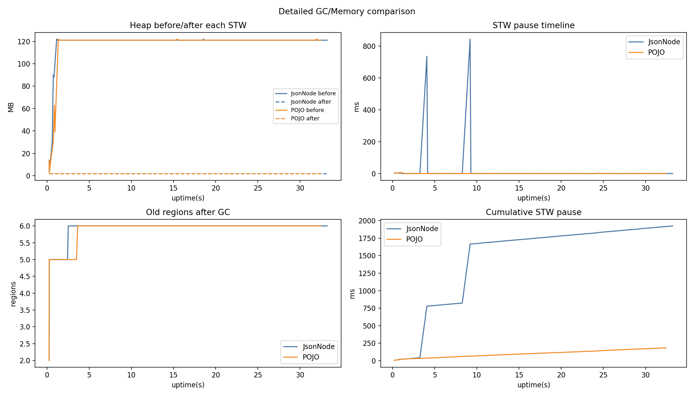
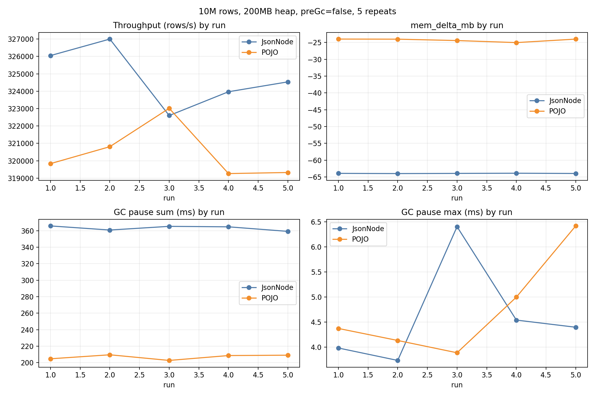

# JsonNode vs POJO 역직렬화 벤치마크 (발표용)

## 1) 실험 목적
- `JsonNode` 기반 파싱과 `POJO` 기반 파싱의 성능/GC 특성 비교
- 데이터 크기를 기존 1M/2M에서 **10M (천만 건)**으로 확장
- 200MB 힙 제한에서 장시간 처리 시 GC/메모리 거동 확인

---

## 2) 실험 조건
- JVM: OpenJDK 21
- Heap: `-Xms200m -Xmx200m`
- 데이터: NDJSON, nested depth 6
- 행 수: `10,000,000`
- 실행 모드:
  - 단일 상세 런(모드별 1회)
  - **반복 런(모드별 5회, 분리 실행)**
- GC 로그: `-Xlog:gc*,gc+heap=debug`
- 참고: 반복 런은 `System.gc()` 강제 호출 없이(`--preGc false`) 측정

---

## 3) 단일 상세 런 결과 (10M)



원본 요약 CSV: `gc_memory_detailed_10m_200m_summary.csv`

핵심 관찰:
- JsonNode 단일 런에서 대형 STW outlier가 관찰됨(최대 pause 매우 큼)
- POJO는 pause 분포가 비교적 안정적으로 나타남
- 단일 런은 outlier 영향이 커서 결론 왜곡 가능

---

## 4) 반복 5회 결과 (10M)



원본 데이터:
- run-by-run: `repeat_10m_200m_nopregc_runs.csv`
- summary: `repeat_10m_200m_nopregc_summary.csv`

### 평균 요약 (5회)

- **JsonNode**
  - Throughput: **324,832 rows/s** (std 1,549)
  - Time: **30,785.8 ms** (std 146.8)
  - GC events: **341.0**
  - GC pause sum: **363.2 ms** (std 2.65)
  - GC pause max: **4.61 ms** (std 0.94)

- **POJO**
  - Throughput: **320,451 rows/s** (std 1,398)
  - Time: **31,206.6 ms** (std 135.6)
  - GC events: **208.0**
  - GC pause sum: **207.0 ms** (std 2.72)
  - GC pause max: **4.76 ms** (std 0.91)

---

## 5) 해석 (발표용 결론)
1. **처리량**은 JsonNode가 약 **+1.37%** 우세 (반복 평균 기준).
2. **GC 누적 STW 시간**은 POJO가 더 낮음 (약 **-43%** 수준).
3. **최대 STW pause**는 반복 측정에서는 두 방식이 유사한 범위(약 4~5ms).
4. 즉, 200MB 제약/10M 장시간 처리에서:
   - 순수 처리량 우선: JsonNode 소폭 우세
   - GC 누적 pause/이벤트 최소화 우선: POJO 우세

---

## 6) 주의사항
- `mem_delta_mb`는 시작/종료 시점 스냅샷 차이라 절대 메모리 효율 지표로 단정하면 안 됨.
- 발표/의사결정에는 **반복 평균 + 분산 + GC 지표(p95/p99 포함)**를 함께 사용 권장.

---

## 7) 재현 커맨드 (요약)
```bash
# 10M, 분리 5회
java -Xms200m -Xmx200m -Xlog:gc*,gc+heap=debug:file=gc_jsonnode.log:time,uptime,level,tags \
  -cp 'build/classes:lib/*' com.oddments.bench.DeserializeBenchmarkApp \
  --mode jsonnode --rows 10000000 --data build/data/payload_java_10m.ndjson --out jsonnode.csv

java -Xms200m -Xmx200m -Xlog:gc*,gc+heap=debug:file=gc_pojo.log:time,uptime,level,tags \
  -cp 'build/classes:lib/*' com.oddments.bench.DeserializeBenchmarkApp \
  --mode pojo --rows 10000000 --data build/data/payload_java_10m.ndjson --out pojo.csv
```
