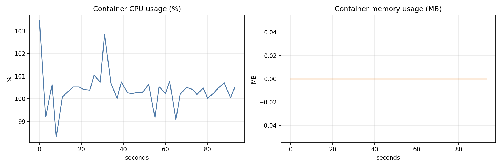

# Docker Benchmark Report (docker_10m_200m)

## Single-run benchmark results

- JsonNode: 30758 ms, 325118.67 rows/s, mem_delta=38.49 MB
- POJO: 29950 ms, 333889.82 rows/s, mem_delta=6.74 MB

- Throughput compare: **POJO +2.70%** vs JsonNode
- Time compare: **POJO faster by 808 ms**

## GC summary

- JsonNode: events=756, pause_sum=509.55 ms, pause_max=16.10 ms, pause_p95=0.68 ms
- POJO: events=459, pause_sum=250.11 ms, pause_max=18.87 ms, pause_p95=0.44 ms

## Container CPU/Memory stats

- samples: 37
- CPU avg: **100.41%**, CPU peak: **103.46%**
- Mem avg: **0.00 MB**, Mem peak: **0.00 MB**

## Charts

