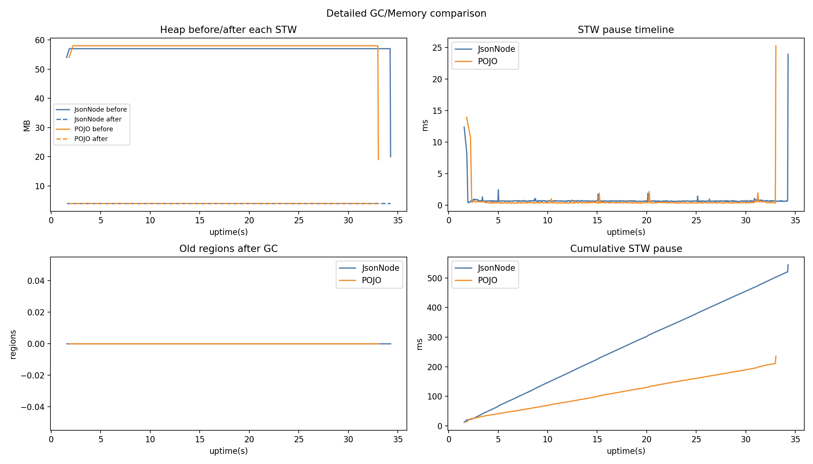
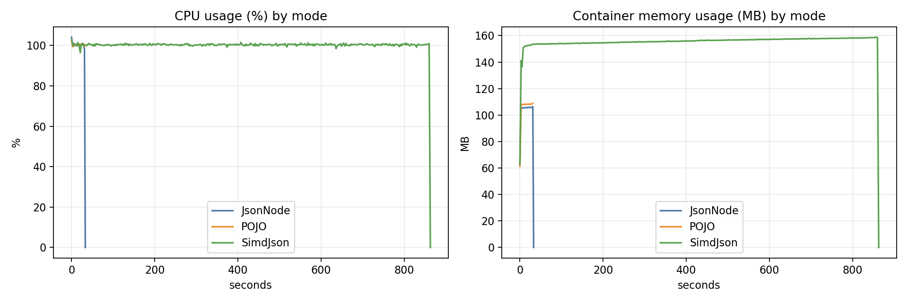

# Docker Benchmark Report (docker_10m_200m)

## Single-run benchmark results

- JsonNode: 32162 ms, 310925.94 rows/s, mem_delta=-11.21 MB
- POJO: 30672 ms, 326030.26 rows/s, mem_delta=8.77 MB
- SimdJson: 855953 ms, 11682.88 rows/s, mem_delta=16.20 MB

- Throughput compare: **POJO +4.86%** vs JsonNode
- Time compare: **POJO faster by 1490 ms**
- SimdJson throughput vs JsonNode: **-96.24%**
- SimdJson throughput vs POJO: **-96.42%**

## GC summary

- JsonNode: events=757, pause_sum=544.57 ms, pause_max=23.93 ms, pause_p95=0.76 ms
- POJO: events=460, pause_sum=236.23 ms, pause_max=25.28 ms, pause_p95=0.54 ms

## Container CPU/Memory stats (mode-separated)

- JsonNode samples: 14, CPU avg/peak: **93.32% / 104.07%**, Mem avg/peak: **95.05 / 106.30 MB**
- POJO samples: 13, CPU avg/peak: **100.38% / 102.21%**, Mem avg/peak: **104.59 / 108.90 MB**
- SimdJson samples: 336, CPU avg/peak: **100.04% / 102.80%**, Mem avg/peak: **155.19 / 158.80 MB**

## Charts

## JFR files

- jsonnode.jfr
- pojo.jfr
- simdjson.jfr