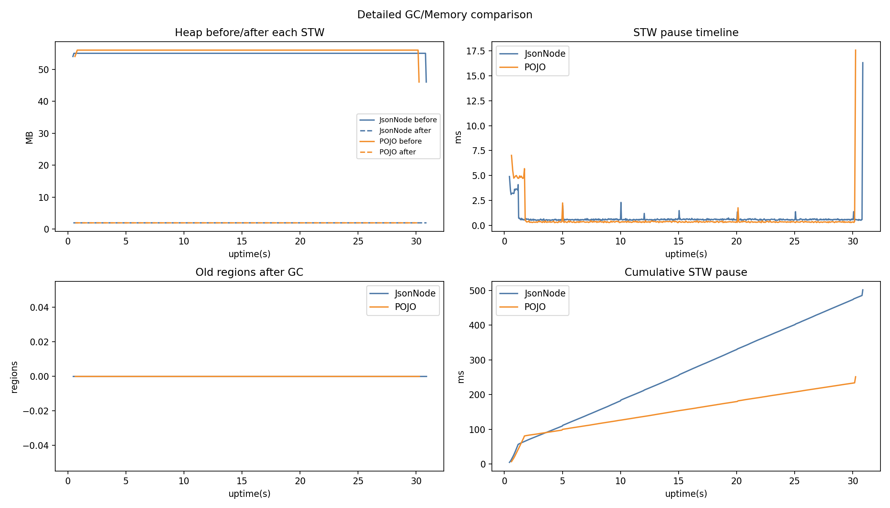
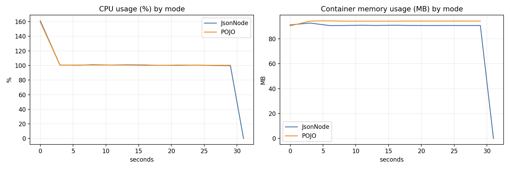

# Docker Benchmark Report (docker_10m_200m_cpu2)

## Single-run benchmark results

- JsonNode: 30207 ms, 331049.09 rows/s, mem_delta=38.49 MB
- POJO: 29445 ms, 339616.23 rows/s, mem_delta=6.74 MB

- Throughput compare: **POJO +2.59%** vs JsonNode
- Time compare: **POJO faster by 762 ms**

## GC summary

- JsonNode: events=756, pause_sum=501.92 ms, pause_max=16.32 ms, pause_p95=0.67 ms
- POJO: events=459, pause_sum=251.54 ms, pause_max=17.59 ms, pause_p95=0.45 ms

## Container CPU/Memory stats (mode-separated)

- JsonNode samples: 13, CPU avg/peak: **97.31% / 161.13%**, Mem avg/peak: **83.94 / 92.68 MB**
- POJO samples: 12, CPU avg/peak: **105.42% / 159.46%**, Mem avg/peak: **93.92 / 94.46 MB**

## Charts

## Analyst note (2-core interpretation)

### 1) 성능
- JsonNode: **331,049 rows/s**, 30,207ms
- POJO: **339,616 rows/s**, 29,445ms

→ **POJO가 약 +2.59% 더 빠르고**, 완료 시간도 **762ms 단축**.

### 2) GC 특성
- JsonNode: events 756, pause sum 501.92ms, p95 0.67ms
- POJO: events 459, pause sum 251.54ms, p95 0.45ms

→ POJO가 **GC 이벤트 수/누적 STW 시간 모두 더 낮음**(대략 절반 수준).  
최대 pause는 두 모드 모두 비슷한 범위(약 16~18ms).

### 3) CPU/메모리 사용
- JsonNode CPU avg/peak: 97.31% / 161.13%
- POJO CPU avg/peak: 105.42% / 159.46%

→ POJO가 평균 CPU를 조금 더 적극적으로 활용하며 처리량을 끌어올린 패턴.  
메모리 평균은 POJO가 약간 더 높지만(93.9MB vs 83.9MB), 1GB 컨테이너 기준 여유 있음.

### 결론 (2코어 조건)
- 실무 관점에서 **POJO 채택이 더 유리**
  - 처리량 우위
  - 누적 GC pause 감소
  - p95 pause도 더 낮음
- JsonNode는 유연성 장점은 있지만, 이번 워크로드에서는 성능 이점이 작음.
