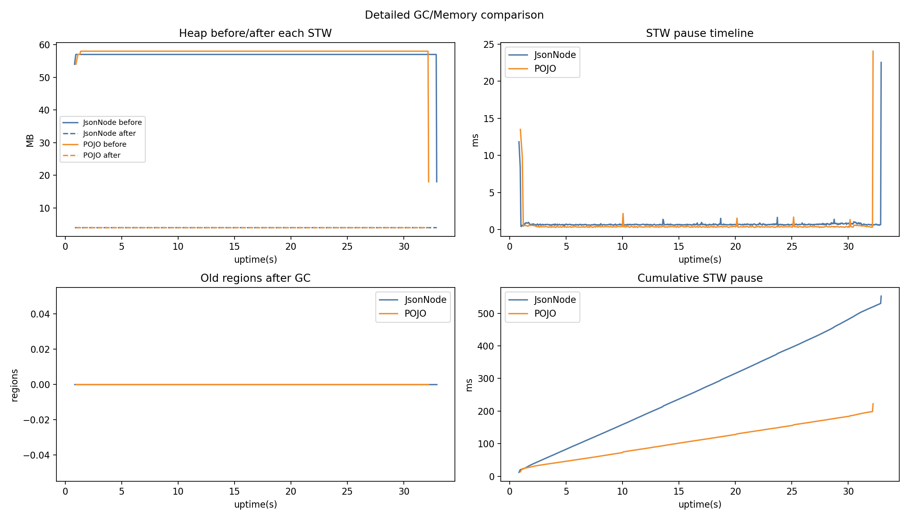
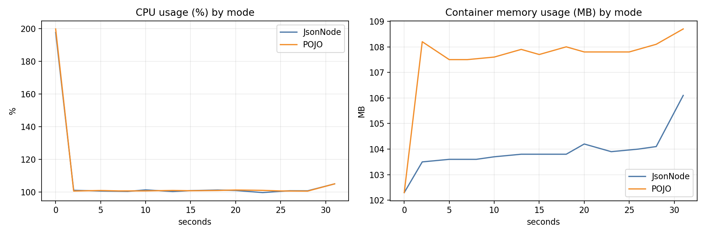

# Docker Benchmark Report (docker_10m_200m_cpu2_jfr)

## Single-run benchmark results

- JsonNode: 31810 ms, 314366.55 rows/s, mem_delta=-11.30 MB
- POJO: 30954 ms, 323060.02 rows/s, mem_delta=8.70 MB

- Throughput compare: **POJO +2.77%** vs JsonNode
- Time compare: **POJO faster by 856 ms**

## GC summary

- JsonNode: events=757, pause_sum=552.65 ms, pause_max=22.55 ms, pause_p95=0.84 ms
- POJO: events=460, pause_sum=222.35 ms, pause_max=24.06 ms, pause_p95=0.52 ms

## Container CPU/Memory stats (mode-separated)

- JsonNode samples: 13, CPU avg/peak: **108.49% / 197.59%**, Mem avg/peak: **103.88 / 106.10 MB**
- POJO samples: 13, CPU avg/peak: **108.76% / 199.77%**, Mem avg/peak: **107.45 / 108.70 MB**

## Charts

## JFR files

- jsonnode.jfr
- pojo.jfr