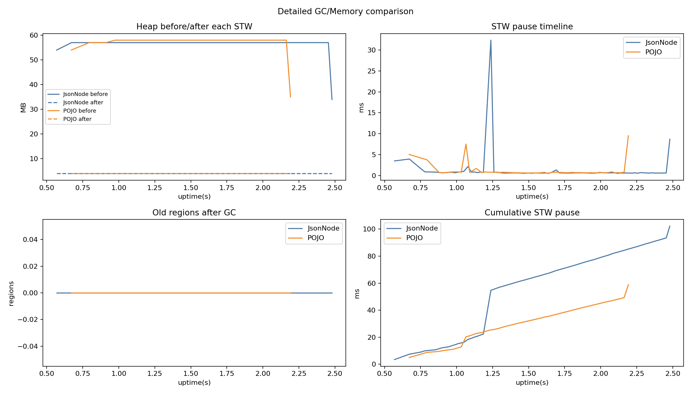
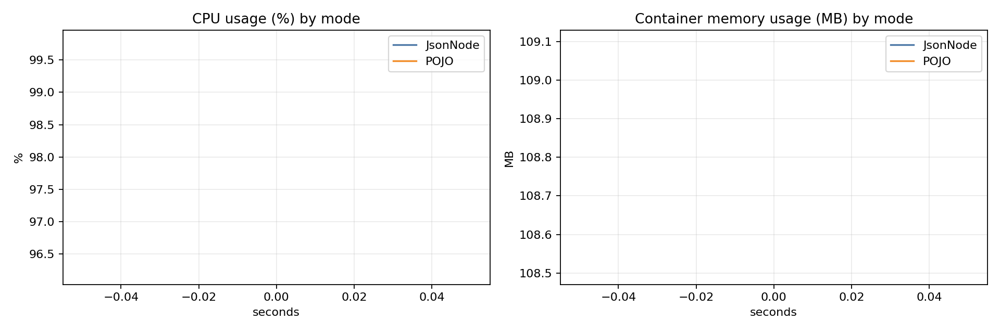

# Docker Benchmark Report (local_mac)

## Single-run benchmark results

- JsonNode: 1624 ms, 615763.55 rows/s, mem_delta=4.69 MB
- POJO: 1297 ms, 771010.02 rows/s, mem_delta=26.82 MB

- Throughput compare: **POJO +25.21%** vs JsonNode
- Time compare: **POJO faster by 327 ms**

## GC summary

- JsonNode: events=80, pause_sum=102.15 ms, pause_max=32.35 ms, pause_p95=2.23 ms
- POJO: events=49, pause_sum=58.90 ms, pause_max=9.52 ms, pause_p95=4.53 ms

## Container CPU/Memory stats (mode-separated)

- JsonNode samples: 1, CPU avg/peak: **96.21% / 96.21%**, Mem avg/peak: **108.50 / 108.50 MB**
- POJO samples: 1, CPU avg/peak: **99.78% / 99.78%**, Mem avg/peak: **109.10 / 109.10 MB**

## Charts

## JFR files

- jsonnode.jfr
- pojo.jfr